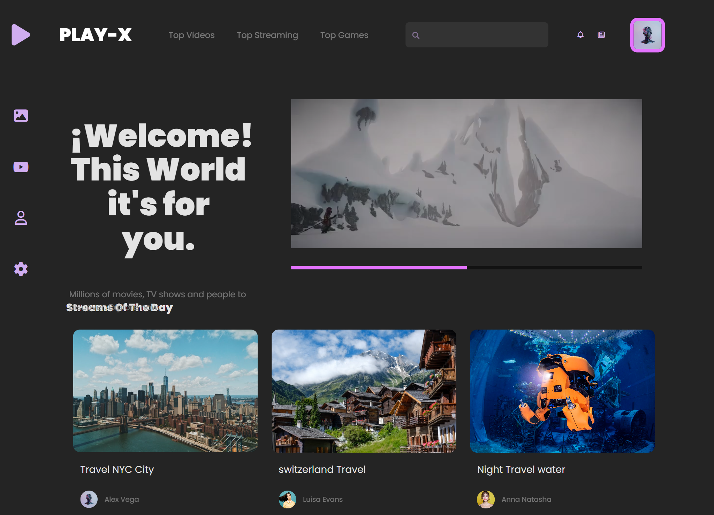

# video_play

Create project with Vanilla Javascript.

# Web Inspiration Design
>
> Design Style

 [Dribble](https://dribbble.com/shots/19867825-Video-Streaming-Platform)

## Vite
 >
 > Tool Frontend - development environment
 [viteJs](https://vitejs.dev/)

> npm create

```
npm create vite@latest
```

```
npm create vite@latest my-vue-app --template vue
```

```
npx degit user/project my-project
cd my-project

npm install
npm run dev
```

> Scripts

```
{
  "scripts": {
    "dev": "vite", // start dev server, aliases: `vite dev`, `vite serve`
    "build": "vite build", // build for production
    "preview": "vite preview" // locally preview production build
  }
}

```

## Project Finished
>
> Project Finished


